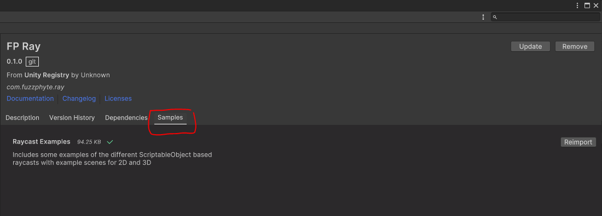
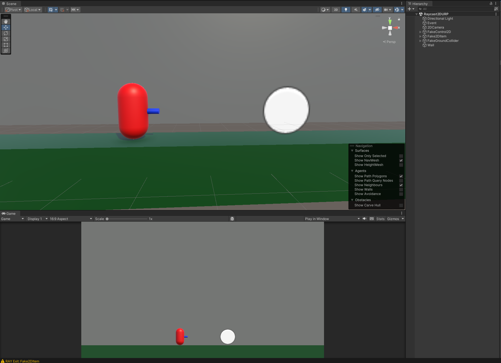
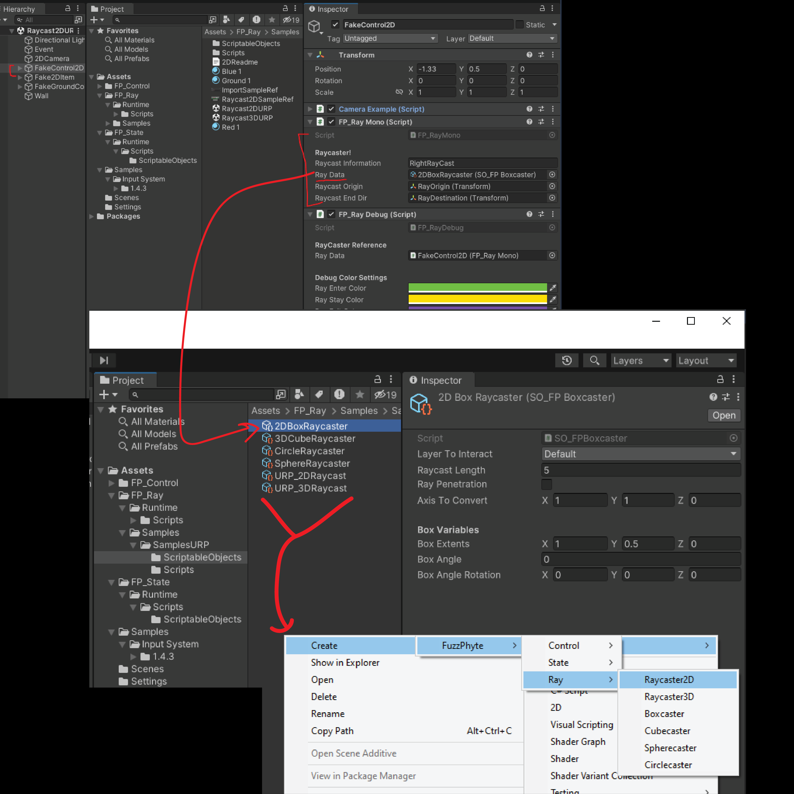
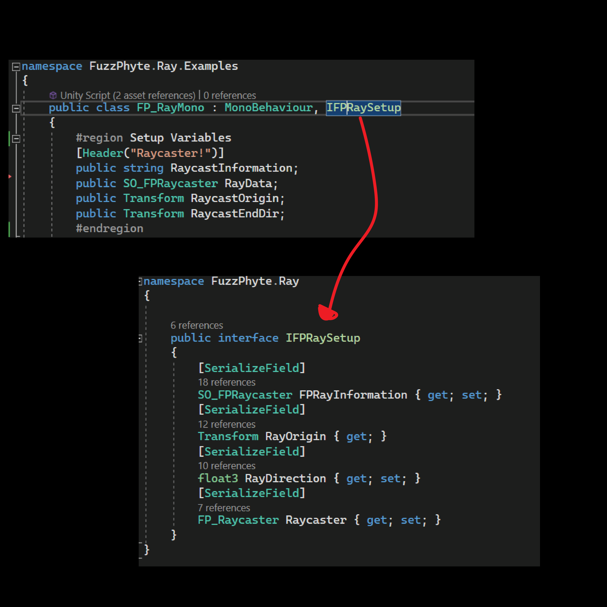
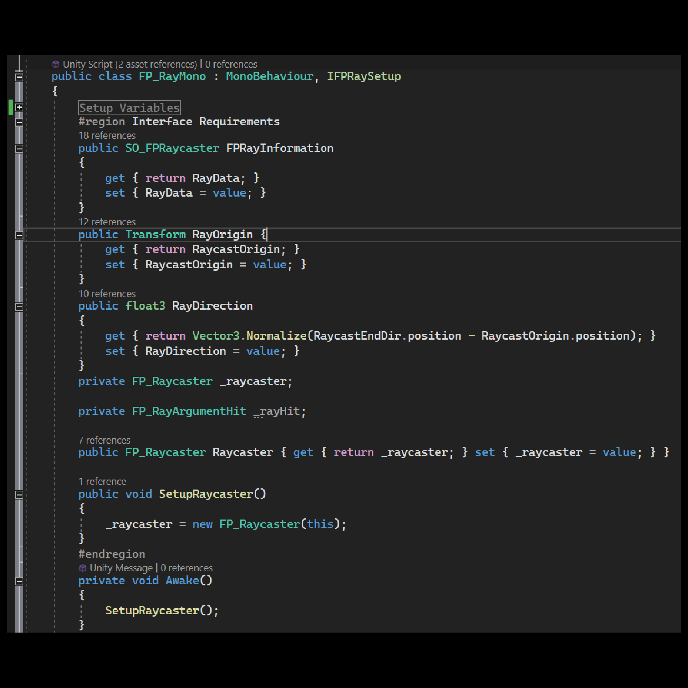
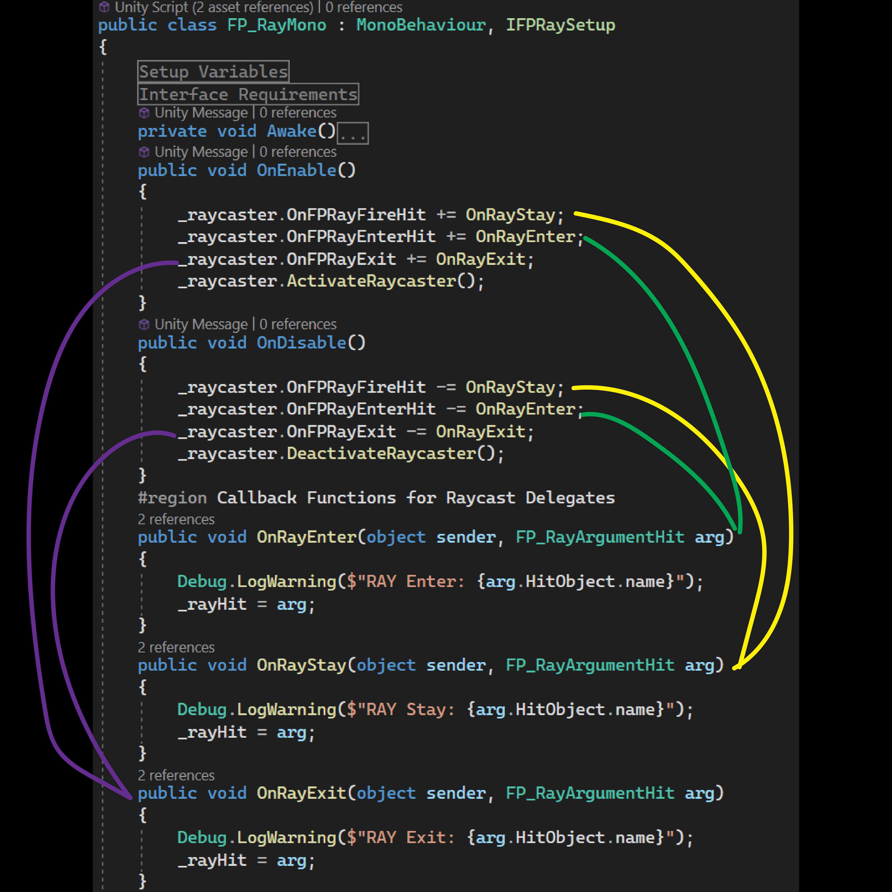
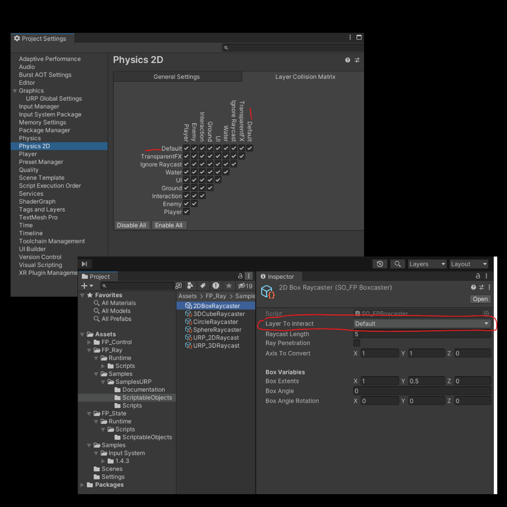

# 2D Raycast Readme

This file is to help walk you through how to utilize this system in a 2D raycasting scenario.

## Setup

* After installing the package make sure you have installed the samples

* After the package samples have installed - open up the 'Raycast2DURP' located in the SamplesURP folder.

* Notice the FakeControl2D GameObject and the associated FP_Ray Mono Script
  * This script is an example Monobehaviour script on how you can utilize the FP_Ray system via invoking the IFPRaySetup interface.
  * The most important part of this script is the scriptable object class 'SO_FPRaycaster': this tells the FP_Ray system what type of raycast you want to perform.
  * Right click in your project window and look to create a new scriptable object it should be under 'create'-->ScriptableObjects-->FuzzPhyte-->Ray'
  

## Diving into the Code

The code base is nothing more than a humble pattern utilizing an interface to decouple a C# class from being forced into a monobehaviour class and listening for messages/callbacks from the system. Open up the FP_RayMono.cs and follow along with the images below to walk through the basic use of the system.

* FP_RayMono.cs is an example you can create your own. It uses the IFPRaySetup interface which is shown below between the [FP_RayMono.cs](./Scripts/FP_RayMono.cs) file and the [IFPRaySetup.cs file](../../Runtime/Scripts/Interfaces/IFPRaySetup.cs).
* 

* FP_RayMono.cs needs to implement the requirements for the interface, those are in the image below which is part of the FP_RayMono.cs file
* 

* Once you have implemented the interface, your MonoBehaviour is now ready to talk with the FP_Ray system - but in order to hear back from the system you need to add the correct listeners to your class. Those are outlined below.
* 

***

At this point as long as your Scriptable Object (data) is correctly setup and your Physics2D/3D Matrix allow you to have the correct collisions the system will report back and activate to these callbacks when those messages fire: on enter, on exit, on stay.

Feel free to copy and use the FP_RayMono.cs as an example - just be aware that this script is always going to be subject to change into future versions.
